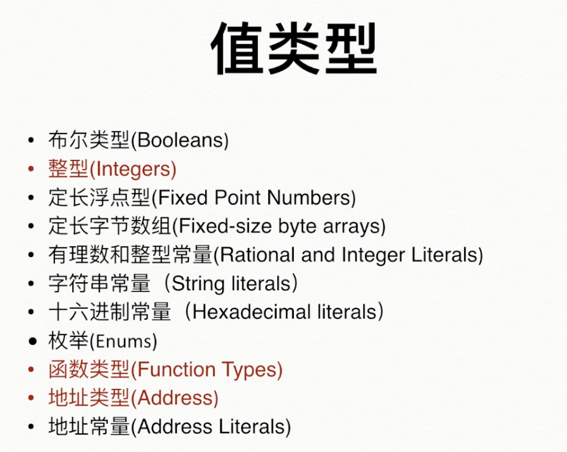
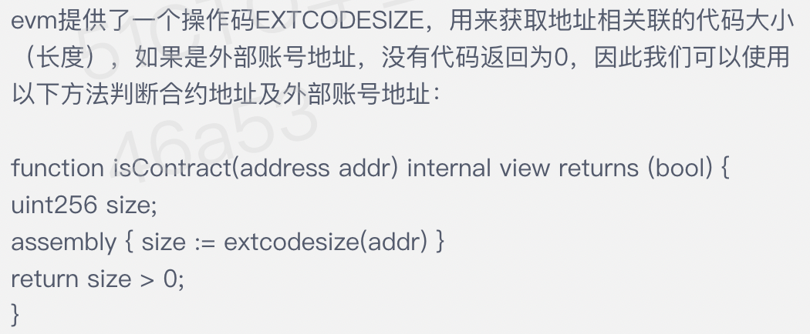
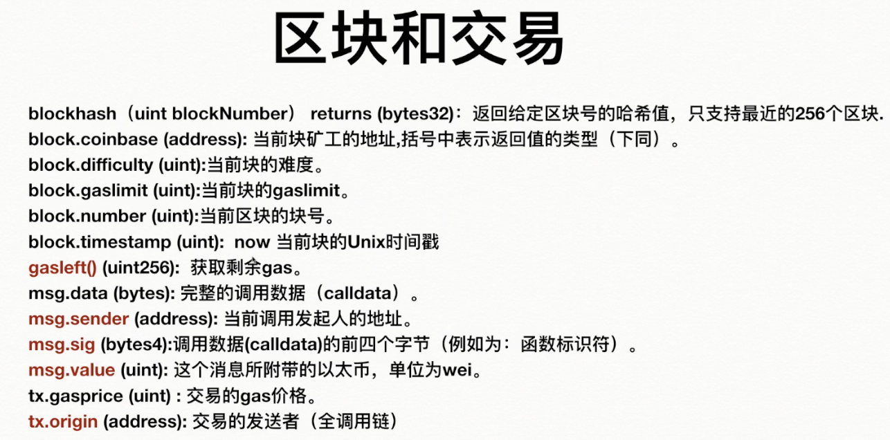
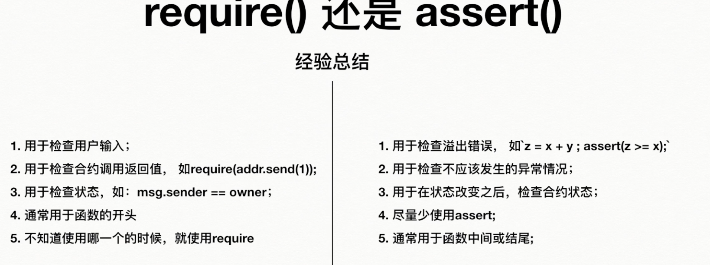

# 区块链学习----登链学院Tiny熊主讲

## part1 区块链入门--零基础搞懂区块链

### 1 区块链的价值

- 由信息互联网到价值互联网 无需第三方做到点对点的价值传输

- 基于人的信任到基于代码的信任 降低营销公关成本

- 效率 去除第三方 比如跨行转账慢 跨境汇款慢

- 隐私 防止第三方收集隐私信息

### 2 区块链的应用场景

- 资产：数字资产发行 支付（跨境支付）交易 结算

- 股权交易 供应链金融 积分

- 公开透明：博彩 众筹 投标 投票

- 点对点：共享经济 内容激励平台 物联网

- 隐私：匿名交易 社交

- 不可篡改：溯源 版权 医疗证明 存在性证明

### 3 区块链从何而来

#### （1）Cypherpunk组织

- 智能合约概念提出者 尼克-萨博

- Facebook创始人 肖恩-帕克

- 中本聪

#### （2）2008中本聪发表比特币白皮书--点对点的电子货币系统

#### （3）由比特币提炼出区块链的概念

#### （4）以太坊--区块链2.0 EOS--区块链3.0

### 4 比特币是什么

> 比特币是数字货币 去中心化记账系统
> 
> 凯恩斯《货币论》 货币是承载价值的一般等价物

### 5 比特币工作原理

#### （1）账本如何验证--区块链结构

- Hash函数

> 哈希函数：Hash（原始信息）= 摘要信息
> 
> 同一个原始信息用同一个Hash函数得到同一个摘要信息
> 
> 原始信息任一微小变化 摘要信息面目全非
> 
> 摘要信息无法逆向推出原始信息

- 计算账本哈希值时原始信息里加上前一个账本的哈希值

- 校验时只需校验最后一个账本的哈希值即可

#### （2）所有权问题--非对称加密

- 银行里密码可以重置 私钥不能重置 只能自己保管

- 由私钥得到地址 地址无法反推私钥

- 不泄漏私钥的前提下 证明拥有某地址的私钥？

> 非对称加密技术（交易签名）
> 
> 如何签名？
> 
> <mark>对交易进行Hash得到摘要 然后用私钥对摘要进行签名 返回签名信息</mark>
> 
> 对相邻节点进行广播
> 
> 节点确认后将交易保存在账本中 再向外广播
> 
> 验证？
> 
> <mark>用签名信息和付款方地址进行验证 返回交易摘要</mark>
> 
> <mark>对交易进行Hash得到摘要 比对两个摘要是否相同</mark>

- 知道地址 不知道地址所有人信息

#### （3）为什么记账--POW挖矿

- 规则

> 一段时间内只有一人记账成功
> 
> 通过解决密码学难题（工作量证明）竞争唯一记账权
> 
> 其他节点复制记账结果

- Hash（上一个Hash，交易记录集，随机数）= 00000aFD635BCD

> 使最后哈希值满足前多少位为0 难度可以根据0位数进行调整
> 
> 找到这么一个随机数使最后条件满足

- 交易记录集

> 广播中未记录到账本中的交易
> 
> 验证交易的有效性
> 
> 加入一笔给自己转账的交易（挖矿奖励）

#### （4）共识机制--以谁的账本为准

- 两个节点同时完成工作量证明机制 使用谁的区块？

> 无仲裁机构 偏向于使用自己的区块
> 
> 每个节点可以独立选择 都选择延长最长链

### 6 P2P网络

- 点对点网络如何发现节点？

> 节点会记住以前连接过的节点
> 
> 节点连接到网络后会广播自己的地址 其他节点收到后会继续广播扩散
> 
> 索要邻居节点连接的节点信息
> 
> 若没有连任何节点 先连种子节点（一直保持活跃的节点）种子节点推荐其他节点
> 
> 断掉节点时 会主动寻找新节点

### 7 以太坊

#### （1）比特币局限性

#### （2）以太坊--智能合约和去中心化应用平台

- 支持高级语言编程

- 每15s出一个快

- 无总量发行限制

- 智能合约

> 以太坊上的程序 是代码和数据（状态）的集合
> 
> Code is Law 不会担心人跑路等问题
> 
> so 区块链改变的是生产关系

### 8 EOS

#### （1）以太坊局限性

- TPS小 TransactionPerSecond

#### （2）EOS：enterprise operation system

#### （3）石墨烯技术 账号系统 无gas

## part2 区块链进阶--深入详解以太坊智能合约语言 solidity

### 1 核心概念

- EVM

> solidity运行在EVM中

- 账户

> 账户就是一个地址Address 20字节
> 
> 状态State 交易序号（交易次数） 余额 数据存储StorageRoot 代码codeHash
> 
> 分类：外部账户EOA（由私钥控制 无代码） 合约账户
> 
> 对EVM来说两类账户是一样的 只不过state不一样
> 
> 账户之间可交互 只能由外部账户发起
> 
> 合约定时执行一个任务？不可以 合约无法定时执行

- 交易

> 从一个账号发到另一个账号的消息
> 
> 内容：以太币 数据payload
> 
> 事务性（原子性）
> 
> 触发消息调用

- 消息调用（内部交易）

> 来源 目标 数据 gas 返回数据
> 
> 消息调用由合约产生 而交易由外部账户产生
> 
> 消息调用支付的是交易的gas 不管交易里有多少消息调用 用的都是发起人的gas
> 
> 调用层数<=1024

- 货币单位

> 1 ether = 10^9 gwei
> 
> 1 gwei = 10^9 wei

- gas

> gas limit 提供多少汽油（用不完可以退）
> 
> gas price 汽油价格
> 
> 矿工费 = gas用量*gas price
> 
> 更高的gas price 矿工更快打包
> 
> gas limit 需要大于gas用量
> 
> 交易复杂度决定gas用量 转账交易的gas是21000
> 
> out of gas 交易回滚 矿工笑纳gas费
> 
> 区块有gas limit 限制任务量 所以矿工优先选择gas price高的任务

- 钱包

> MetaMask 基于浏览器插件形式的钱包 别人给我们同步了区块
> 
> Geth 以太坊客户端
> 
> ...

- 以太坊网络

> 主网 所有操作消耗真实ether
> 
> 测试网络 用做测试
> 
> 私有链
> 
> 模拟环境 在内存中模拟一下 remix里也可用

### 2 开发环境搭建

<mark>科学上网即可</mark>

[Remix IDE](https://remix.ethereum.org/)

VSCode插件：Ethereum Remix、solidity

MetaMask连接Ganache

[Ganache](https://trufflesuite.com/ganache/)

### 3 初探智能合约

```solidity
pragma solidity ^0.4.24; //0.4.25-0.5

import "./first.sol";

contract SimpleStorage {
    uint storageData;

    //定义结构体
    struct Circle {
        uint radius;
    }
    Circle c;

    //定义一个事件
    event Set(uint value);

    // 函数修改器
    modifier mustOver10(uint v){
        require(v >= 10);
        _;
    }

    function set(uint x) public mustOver10(x){
        storageData = x;
        c = Circle(x);
        emit Set(x);
    }
    function get() public constant returns(uint){
        return storageData;
    }
}

//单行注释
/*
多行注释
*/
```

### 4 Solidity类型详解

#### (1)类型介绍

> 静态类型语言 定义时就确定类型 int a = 1;
> 
> 动态类型语言 定义时无需确定类型 var b;
> 
> 值类型 赋值或穿参时总是进行值拷贝
> 
> 引用类型 赋值比较复杂

- Solidity的值类型



#### （2）bool

#### （3）int/uint

- uint8是8位 1个字节（1Byte=8bit）可表示0--255

- c = a++ 与 c = ++a

- 安全使用：溢出问题

```solidity
function add(uint8 a,uint8 b)public pure returns(uint8){
      uint8 x = a + b;
      assert(x >= a);
      return x;  
    }
```

#### (4)fixed/ufixed

- fixedMxN M是位数 为8-256位 N是小数点位数为0-80之间

- 定长字节数组

> bytes1 bytes2 .. bytes32 数字表示所占空间的字节数
> 
> 不跟数字默认是bytes1
> 
> 可用.length获得字节数组长度
> 
> 像字符串一样使用
> 
> 可以像数组一样用下标进行索引

#### （5）常量

- 数字（有理数、整数）常量

> 表达式里直接出现的数字
> 
> 5/2 + 5/2 = ？     5 因为常量不会做截断

- 字符串常量

> 字符串常量不支持任何运算 比如字符串拼接

- 十六进制常量

```solidity
function hexString() public pure returns(bytes2,bytes1,bytes1){
        bytes2 a = hex"aabb";
        return (a,a[0],a[1]);
    }
//a[0] 0xaa  a[1] 0xbb
```

#### (6)枚举enum

- 可与整数进行转换 但不能进行隐式转换

- 枚举类型应至少有一名成员

```solidity
    enum Action {left,right,forword,still}

    Action choice;

    function setforword() public returns(uint){
        choice = Action.forword;
        return uint(choice);
    }
```

#### (7)<mark>地址类型</mark>

- address表示账户地址 20字节

- 成员：成员变量.balance余额 单位为wei  成员方法transfer()用来转币

- send()

> 与transfer()不同之处在于 错误时不会发生异常而是会有一个返回值false
> 
> 使用时一定要检查返回值 大部分时候使用transfer
> 
> add.transfer(y)  == require(add.send(y))
> 
> transfer 和 send 都有2300gas的限制 当合约接收币时容易失败

```solidity
pragma solidity ^0.4.24; //0.4.25-0.5

contract Called{ //被调合约
    function getBalance() public view returns(uint) {
        return address(this).balance;
    }

    event logdata(bytes data);
    //给合约转账时添加一个回退函数
    //回退函数里消耗的gas已经超过了2300
    function () public payable{
        emit logdata(msg.data);
        emit logdata(msg.data);
    }

}

contract CallTest{ //主调合约
    constructor() public payable {

    }
    function transferEther(address to) public returns(bool) {
        to.transfer(1 ether);
        return true;
    }
}
```

- call() delegatecall() 两个成员函数可以调其他合约的函数

- call可以用.value()附加以太币 add.call.value(y) ()   ==  add.transfer(y) 无gas限制

- call还可以用.gas() 指定给调用的函数多少gas

- delegatecall() 无.value()

- 使用call时会改变被调函数上下文 sender是主调合约地址 而delegatecall不会改变被调函数上下文 只是使用了被调合约的被调函数 被调合约其他值未改变 改变的是主调合约的值
  
  ```solidity
   pragma solidity ^0.4.24;
  
  contract Called{ //被调合约
  
      function () public payable{
  
      }
  
      uint public n;
      address public sender;
      //加上payable call这个函数时才可以用value附加币
      function setN(uint _n) public payable{ //被调函数
          n = _n;
          sender = msg.sender;
      }
  
  }
  
  contract CallTest{ //主调合约
      constructor() public payable {
  
      }
      //  _e 是被调合约的地址 此时被调合约的sender为主调合约地址
      //用call调用时 msg.sender为当前合约地址
      function callSetN(address _e,uint _n) public {
          //获得函数签名 取哈希值的前四个字节
          bytes4 methodId = bytes4(keccak256("setN(uint256)"));
          require(_e.call.value(1 ether)(methodId,_n));
      }
  
      uint public n;
      address public sender;
      //此时n修改的是主调函数的n sender为调用主调合约的地址
      function delegatecallSetN(address _e,uint _n) public {
          //获得函数签名 取哈希值的前四个字节
          bytes4 methodId = bytes4(keccak256("setN(uint256)"));
          require(_e.delegatecall(methodId,_n));
      }
  }
  ```

- 如何区分合约账户和外部账户



#### (8)函数类型

- 外部函数 发起EVM消息调用 使用地址.函数名进行调用

- 内部函数 无消息调用只是代码跳转 gas小 无法在合约外部调用 使用函数名调用

- 未指明则默认为内部函数

- 成员 .selector返回函数选择器（16进制4字节数组） 内部函数没这个属性

- EVM调用一个函数 便是利用函数的选择器

- function (uint) external returns(uint) foo;声明了一个函数类型的变量foo

- 声明函数和定义函数不同 定义函数时需要有实现体

#### (9)<mark>数据存储位置</mark>

- storage 存在区块链中

> 状态变量 合约里不属于任何函数的变量
> 
> contract A { uint a;}
> 
> 复杂类型局部变量
> 
> contract A(function fun(){uint[] arr;})

- memory 存在EVM内存中 随着交易结束就消失

> 局部变量及参数
> 
> contract A {function fun(uint[] arr){uint a;}}

- memory与storage之间赋值进行完全独立的拷贝

- 状态变量与状态变量之间也是完全独立的拷贝

- 复杂类型局部变量与storage之间是引用的传递（delete时会影响）

#### (10)数组

```soidity
pragma solidity ^0.4.24;

contract testArr{ 
    uint[10] tens;
    uint[] us;
    uint[] public u = [1,2,3];

    uint[] public b = new uint[](7);

    uint[][3] i;

    function set() public {
    //多维数组 每个数组都是变长数组 共3个
    //数组是复杂局部变量 在storage中
    uint[][3] storage y = i; //防止Uninitialized storage pointer.
    y[0] = [1,2,3,4];
    y[1] = [1,2];
    y[2] = [0,5,4];
    }
}
```

- .length查看数组长度 对于storage的数组 还可以修改。length改变其长度

- memory数组一旦创建不能修改大小 无法修改length

- push() 添加元素 返回新数组长度 仅支持变长数组 memory数组不可以用

#### (11)字节数组

- bytes[]作为外部函数参数时占用空间比byte[]小

#### (12)字符串数组

- 字符串也是数组 没有.lenght属性 可用 bytes(s).length

- bytes(s)[k] 获得下标为k的UTF-8编码

- bytes存储任意长度的字节数据 string存储UTF-8编码的字符串数据

- stringutils库

> using strings for * 对所有类型适用strings库方法

#### (13)映射

- 键值不能是变长数组、合约类型、嵌套类型

- 值类型无限制

- 访问不存在的键 返回的是默认值

- 只能作为状态变量使用 无法在函数里定义mapping

- 无法遍历访问

- iterable_mapping 第三方包用来便捷操作mapping

#### (14)结构体

- 结构体只能在合约内部使用或继承合约内使用 若要在函数返回值中使用结构体 函数必须声明internal（新版本就不需要了）

#### (15)类型转换与delete重置变量

- 隐式转换：小向大 不丢失数据编译器尝试隐式转换

- 显示转换：不正确会带来错误 高位会被截断

- delete对mapping无效 不会影响拷贝后的变量

### 5 Solidity内置API

#### (1)时间与日期

- 时间戳与日期转换的库 ethereum-datatime

- 一天执行一次？

```solidity
pragma solidity ^0.4.26;

contract testTime{
    uint lastTs;

    function currTS() public view returns(uint){
        return now;
    }

    function doSomething() public {
        if(now >= lastTs + 1 days) {
            //do someting
        }
        lastTs = now;
    }
}
```

- 高级：`using DateTime for uint;` 就可以`now.getYear();`否则只能`DataTime.getYear(now);`

#### (2)区块及交易信息API



- msg.sender是主调合约地址 tx.origin仍是调用主调合约的调用人地址

#### (3)ABI?（not API）

- ABI：application binary interface 应用程序二进制接口

- 调用一个合约函数 即 向合约地址发送一个交易 交易内容就是ABI编码数据

#### (4)错误处理函数

- 无cry catch 因为区块链是全球共享的分布式<mark>事务性</mark>数据库 修改要么都生效 要么全回滚

- assert require revert

> assert 程序内部异常 消耗掉所有剩余gas
> 
> require 外部条件异常 剩余gas返还调用者
> 
> revert 回滚



#### (5)数学及加密API

- addMod...

- 哈希函数（散列函数） 任意长度的输入转换为固定长度的输出

> MD-4 MD-5
> 
> SHA-1 不安全 不同输入可能得到相同输出
> 
> SHA-2:SHA-256 ...
> 
> SHA-3:Keccak算法...

#### (6)地址及合约API

### 6 Solidity进阶

## part3 区块链进阶--通过代币（Token）学以太坊智能合约

## part4 区块链全栈开发--以太坊DAPP开发实战
